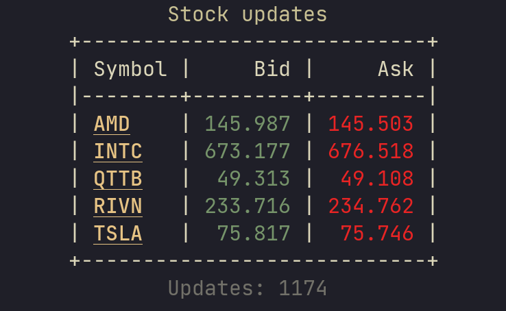

# Streaming Stonks

Streaming gRPC client/server application, showing (fictive) stock updates in dotnet 8.

Server is a simple [gRPC](https://grpc.io/) server that continously streams randomized stock updates to any client that requests updates.

Client is a [TUI](https://en.wikipedia.org/wiki/Text-based_user_interface) showing updates to the stock symbols it requests.
This is achieved using [Spectre.Console](https://spectreconsole.net/)

## Running

- Server: `dotnet run --project StockServer`
- Client: `dotnet run --project StockClientTui`

